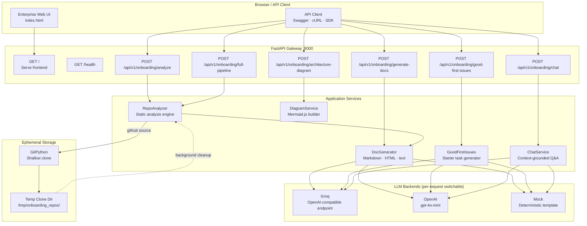

<div align="center">

# OmniDev

### AI-Powered Developer Onboarding Platform

*Point OmniDev at any repository — local or on GitHub — and receive production-ready onboarding documentation, an architecture diagram, tailored starter tasks, and an interactive codebase chat in seconds.*

[](https://www.python.org/)
[](https://fastapi.tiangolo.com/)
[](https://console.groq.com/)
[](LICENSE)

</div>

---

## Table of Contents

1. [Project Overview](#1-project-overview)
2. [Key Features](#2-key-features)
3. [Architecture](#3-architecture)
4. [Tech Stack](#4-tech-stack)
5. [Prerequisites](#5-prerequisites)
6. [Getting Started](#6-getting-started)
   - [Clone the repository](#61-clone-the-repository)
   - [Create a virtual environment](#62-create-a-virtual-environment)
   - [Install dependencies](#63-install-dependencies)
   - [Configure environment variables](#64-configure-environment-variables)
   - [Run the application](#65-run-the-application)
7. [Accessing the Interface](#7-accessing-the-interface)
8. [API Reference](#8-api-reference)
9. [LLM Providers](#9-llm-providers)
10. [Project Structure](#10-project-structure)
11. [Contributing](#11-contributing)
12. [License](#12-license)

---

## 1. Project Overview

**OmniDev** is an enterprise-grade developer onboarding platform built on [FastAPI](https://fastapi.tiangolo.com/). It performs static analysis of any Git repository (local path or remote GitHub URL) and uses large language models — [Groq](https://groq.com/) or [OpenAI](https://openai.com/) — to produce:

- **Setup documentation** — step-by-step guides covering prerequisites, installation, environment configuration, running locally, and testing.
- **Architecture diagrams** — auto-generated [Mermaid.js](https://mermaid.js.org/) flowcharts rendered live in the browser.
- **Good First Issues** — personalised starter tasks tailored to the repo's actual codebase, helping new contributors become productive immediately.
- **Codebase chat** — a context-aware Q&A interface powered by the same LLM, grounded in the generated documentation.

OmniDev ships with a zero-dependency **mock backend** so the entire platform can be explored without any API keys.

---

## 2. Key Features

| Capability | Description |
|---|---|
| **Repository Analysis** | Language detection, dependency parsing, framework fingerprinting, entry-point discovery, environment-variable scraping, and test/CI/Docker detection — all without an LLM |
| **Multi-format Docs** | Generates onboarding guides in Markdown, HTML, or plain text |
| **Mermaid Diagrams** | Auto-generates and renders architecture flow diagrams from repo structure |
| **Good First Issues** | Creates 3–5 tailored, actionable starter tasks with file targets and instructions |
| **Codebase Chat** | Context-grounded Q&A — ask anything about the repository |
| **Full Pipeline Endpoint** | Analyse + generate docs in a **single API call** |
| **Multiple LLM Backends** | Groq (default), OpenAI, or a deterministic mock — switchable per request |
| **API-Key-Free Demo** | Use the `mock` provider for instant results with no keys required |
| **Enterprise UI** | Served at `/` — no separate frontend server needed |

---

## 3. Architecture



---

## 4. Tech Stack

| Layer | Technology |
|---|---|
| **Web Framework** | [FastAPI](https://fastapi.tiangolo.com/) 0.111 + [Uvicorn](https://www.uvicorn.org/) 0.29 (ASGI) |
| **Data Validation** | [Pydantic](https://docs.pydantic.dev/) v2 + pydantic-settings |
| **LLM — primary** | [Groq](https://groq.com/) via OpenAI-compatible SDK |
| **LLM — secondary** | [OpenAI](https://openai.com/) Python SDK |
| **HTTP Client** | [httpx](https://www.python-httpx.org/) (async) |
| **Git Integration** | [GitPython](https://gitpython.readthedocs.io/) |
| **Config** | python-dotenv + pydantic-settings |
| **Frontend** | Vanilla HTML/CSS/JS + [Mermaid.js](https://mermaid.js.org/) (CDN) |
| **Runtime** | Python 3.11+ |

---

## 5. Prerequisites

- **Python 3.11 or newer** — [python.org/downloads](https://www.python.org/downloads/)
- **Git** — required for remote GitHub repository analysis
- **A Groq API key** *(optional)* — free tier available at [console.groq.com/keys](https://console.groq.com/keys)
- **An OpenAI API key** *(optional)* — only needed if using the `openai` provider

> **No API keys required to run OmniDev.** The `mock` provider works entirely offline and is the default fallback.

---

## 6. Getting Started

### 6.1 Clone the repository

```bash
git clone https://github.com/your-org/omnidev.git
cd omnidev/smart-onboarding-assistant
```

### 6.2 Create a virtual environment

```bash
# macOS / Linux
python3 -m venv venv
source venv/bin/activate

# Windows (PowerShell)
python -m venv venv
.\venv\Scripts\Activate.ps1
```

### 6.3 Install dependencies

```bash
pip install -r requirements.txt
```

The `requirements.txt` includes only direct production dependencies:

```
fastapi==0.111.0
uvicorn[standard]==0.29.0
pydantic==2.7.1
pydantic-settings==2.2.1
httpx==0.27.0
gitpython==3.1.43
python-multipart==0.0.9
openai==1.30.1
python-dotenv==1.0.1
```

### 6.4 Configure environment variables

Copy the example file and edit it with your values:

```bash
cp .env.example .env
```

Open `.env` in your editor. The file is self-documented — key settings are:

```dotenv
# ── Application ───────────────────────────────────────────────────────────────
APP_NAME="OmniDev"
APP_VERSION="1.0.0"
DEBUG=false

# ── Server ────────────────────────────────────────────────────────────────────
HOST=0.0.0.0
PORT=8000

# ── Groq  (primary LLM — free tier available) ────────────────────────────────
# Get your key: https://console.groq.com/keys
GROQ_API_KEY=gsk_...
GROQ_MODEL=openai/gpt-oss-20b
GROQ_MAX_TOKENS=4096
GROQ_TEMPERATURE=0.3

# ── OpenAI  (optional secondary LLM) ─────────────────────────────────────────
OPENAI_API_KEY=sk-...
OPENAI_MODEL=gpt-4o-mini
OPENAI_MAX_TOKENS=4096
OPENAI_TEMPERATURE=0.3

# ── Repository Analysis ───────────────────────────────────────────────────────
# Temporary directory used when cloning remote GitHub repositories
CLONE_BASE_DIR=/tmp/onboarding_repos

# ── CORS ──────────────────────────────────────────────────────────────────────
CORS_ORIGINS=["*"]
```

> **Tip:** The `GROQ_API_KEY` and `OPENAI_API_KEY` fields are optional.
> Set `llm_provider` to `"mock"` in any API request to skip LLM calls entirely.
> API keys can also be passed per-request via the `X-Groq-Api-Key` HTTP header.

### 6.5 Run the application

**Recommended — use the bundled launcher:**

```bash
python run.py
```

`run.py` starts Uvicorn, streams its logs to the terminal, and handles graceful shutdown on `Ctrl-C`.

**Alternative — invoke Uvicorn directly:**

```bash
python main.py
# or
uvicorn main:app --host 127.0.0.1 --port 8000 --reload
```

---

## 7. Accessing the Interface

Once the server is running you will see:

```
══════════════════════════════════════════════════════════════
  OmniDev
══════════════════════════════════════════════════════════════
  App  (UI)  ->  http://127.0.0.1:8000/
  API  docs  ->  http://127.0.0.1:8000/docs
══════════════════════════════════════════════════════════════
  Press Ctrl-C to stop.
```

| URL | Description |
|---|---|
| `http://127.0.0.1:8000/` | Enterprise web interface |
| `http://127.0.0.1:8000/docs` | Interactive Swagger UI (full API explorer) |
| `http://127.0.0.1:8000/redoc` | ReDoc API reference |
| `http://127.0.0.1:8000/health` | Health check — returns `{"status":"ok"}` |

---

## 8. API Reference

### `POST /api/v1/onboarding/analyze`
Analyse a local filesystem path or a remote GitHub repository. Returns structured metadata.

```jsonc
// Local repository
{ "source": "local", "path": "/home/dev/my-project" }

// Remote GitHub repository
{ "source": "github", "github_url": "https://github.com/owner/repo", "branch": "main" }
```

### `POST /api/v1/onboarding/generate-docs`
Generate setup documentation from a pre-computed analysis result.

```jsonc
{
  "analysis": { /* RepoAnalysisResult from /analyze */ },
  "doc_format": "markdown",          // "markdown" | "html" | "text"
  "llm_provider": "groq",            // "groq" | "openai" | "mock"
  "audience": "junior developer"
}
```

### `POST /api/v1/onboarding/architecture-diagram`
Analyse a repository and return a Mermaid.js flowchart string.

```jsonc
{ "source": "github", "github_url": "https://github.com/owner/repo" }
```

### `POST /api/v1/onboarding/good-first-issues`
Generate tailored starter tasks for a new contributor.

```jsonc
{
  "analysis": { /* RepoAnalysisResult */ },
  "llm_provider": "groq",
  "num_issues": 3
}
```

### `POST /api/v1/onboarding/full-pipeline`
Analyse **and** generate docs in a single HTTP round-trip.

```jsonc
{
  "source": "github",
  "github_url": "https://github.com/tiangolo/fastapi",
  "branch": "master",
  "doc_format": "markdown",
  "llm_provider": "groq"
}
```

### `POST /api/v1/onboarding/chat`
Ask a question grounded in the generated documentation context.

```jsonc
{
  "question": "How do I run the test suite?",
  "documentation_context": "... generated docs ...",
  "llm_provider": "groq"
}
```

---

## 9. LLM Providers

| `llm_provider` | API Key Required | Notes |
|---|---|---|
| `mock` | No | Deterministic, template-based output. Ideal for CI, testing, and offline demos. |
| `groq` | Yes — `GROQ_API_KEY` | Default. Uses Groq's OpenAI-compatible endpoint. Fast, generous free tier. |
| `openai` | Yes — `OPENAI_API_KEY` | Uses `gpt-4o-mini` by default (configurable via `OPENAI_MODEL`). |

Keys can be supplied:
1. In the `.env` file (loaded at startup).
2. Via the `X-Groq-Api-Key` request header (per-request override, no server restart needed).

---

## 10. Project Structure

```
smart-onboarding-assistant/
├── main.py                    # FastAPI application factory & entry point
├── run.py                     # Launcher script (Uvicorn wrapper with graceful shutdown)
├── requirements.txt           # Direct production dependencies
├── .env.example               # Environment variable template — copy to .env
│
├── app/
│   ├── config.py              # Pydantic Settings — reads .env, provides get_settings()
│   ├── models/
│   │   └── schemas.py         # All Pydantic request / response models
│   ├── routers/
│   │   └── onboarding.py      # API routes (/analyze · /generate-docs · /full-pipeline · …)
│   ├── services/
│   │   ├── repo_analyzer.py   # Static analysis engine (language, deps, frameworks, …)
│   │   ├── doc_generator.py   # Documentation generation (Groq · OpenAI · mock)
│   │   ├── diagram_service.py # Mermaid.js architecture diagram builder
│   │   ├── good_first_issues_service.py  # Starter task generator
│   │   └── chat_service.py    # Context-grounded codebase Q&A
│   └── utils/                 # Shared utility helpers
│
└── frontend/
    └── index.html             # Enterprise single-page UI (served at /)
```

---

## 11. Contributing

1. Fork the repository and create a feature branch: `git checkout -b feat/my-feature`
2. Install development dependencies and run the test suite: `pytest`
3. Commit your changes following [Conventional Commits](https://www.conventionalcommits.org/)
4. Open a pull request — the CI pipeline will validate your changes automatically

---

## 12. License

This project is released under the [MIT License](LICENSE).

---

<div align="center">
  <sub>Built for the IBM BoB 2.0 Hackathon &nbsp;·&nbsp; OmniDev — accelerating developer onboarding with AI</sub>
</div>
